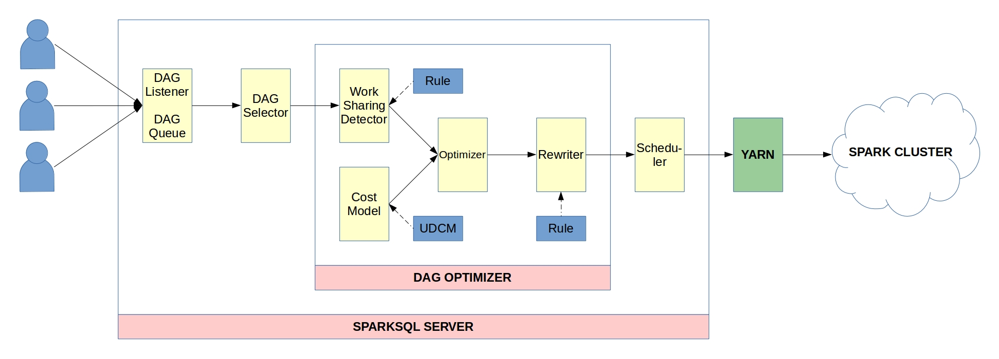

Spark Server - Project internals
===========================================================================
#Why we do this?
In real-world collaborative environment, performing big data computations on sharing input data sources, in fact, happens very frequently. Each individual user is usually interested in particular part of input data. The chance that they would share the input and computations increases significantly as the organization's scale grows.

Avoiding redundant works (doing the same work for more than once) is a common optimization that we can apply to this scenario. By realizing this optimization on Apache Spark, our proposed framework would bring benefits: saving resources of cluster, increasing in the overall performance, reducing the job running time, ...

Sample usecase in which the cluster has to read the input from disk (a costly operation) more than once:
```scala
//User1
val input = sc.textFile(“InputA”)
val errors = input.filter(_.contains(“ERROR”))
//performing on errors
errors.saveAsTextFile(“error”)

//User2
val input = sc.textFile(“InputA”)
val warnings = input.filter(_.contains(“WARNING”))
//performing on warnings
warnings.saveAsTextFile(“warn”)

//User3
val input = sc.textFile(“InputA”)
val info = input.filter(_.contains(“INFO”))
//performing on info
info.saveAsTextFile(“info”)
```

# Defining problems
In order to avoiding redundant works, we have to find a way to appropriate cache the data (eg input file or computed checkpoint results, ...) or even pipeline/combine multiple jobs in order to save the computation.

In Spark, applications submited to cluster by clients are totally isolated from each other, therefore, sharing the computations accross applications is not viable with current implementation of the framework (using Tachyon is an option but let's discuss later).

A job contains a DAG which is a series of RDDs (each RDD node represents a computation on previous RDD output). A single SparkContext (the main entry point used to submit jobs) is created for each application. Thus, one application cannot access to possibly previous computed result of another job.

#How we do this?
- What we need is a centralized Spark Server:
    + sits between clients and YARN
    + recieves submited jobs from clients
    + where optimizations will be applied
    + submits optimized jobs to the cluster
    + appropriate scheduling strategy

###Spark Server system design


####DAG Listener & DAG Queue
- Users submit their jobs to SparkSQL Server just as a normal submit to cluster
    + Use spark command with additional argument: `--send-to sparksqlserver`
    + From users' perspective, SparkSQL Server is transparent
    + the jar file and DAGs are sent to SparkSQL Server
- **DAG Listener** listens to clients’ connections and receives the DAGs - queries, then passes to the DAG Queue. The DAG Queue accepts the information that clients send at the FIFO order. In this stage, the full DAG of each user will be built based on the initial DAG, the DataFrame creation information and the query. The **DAG Queue** has a window of fixed size as a threshold - number of DAGs to be packed. When this threshold is reached, the DAG Queue will send a batch of DAGs into the next components - **DAG Selector**. 
=> Change: Not only rely on WindowSize of **DAG Queue**, but also on elapsed time

####DAG Selector
A pre-scheduler which performs scheduling based on the constraints attached within each query to fulfill user’s requirements. For example: job submitted with a deadline. Right now, it just uses the simple FIFO strategy.

####DAG Optimizer
- Recieves bags of selected job that can be optimized
- Decides how to effectively optimize the job

#####Work Sharing Detector
- Generates bags of DAGs which are labeled with sharing-type or no-sharing.
- Rule based optimizations: applying pre-defined rules that detect the chance of sharing opportunities

#####Cost Model
- It is not always true that combining jobs will yield better performance
- The main reason is the cost of sorting, shuffling,... may outgrows the advantage of reading the input once
- The Cost Model will be used to address this problem: evaluate how much it costs on each operations: reading, shuffling, joining, ... 
- Provides pluggable interface allowing users to define their configurations

#####Optimizer
- Generates plans to execute the job
- Uses the **Cost Model** to pick the plan with the lowest cost

#####Rewriter
The best plan will be the input of the Rewriter. The rewriter will know which rule it should apply to the plan to get the transformed plan. The rule is also plugable and users can add their own for sure.
Some operations:
- inject the cache statement
- pipeline jobs
- merge to single job

####Scheduler
- modifies the queue before submision to make sure that the job that have coverage will be the first to be executed.
- Right now, we just use the FIFO for all DAGs. For scan sharing, if a rewrite has a caching, the order will be re-organized so that the DAG with caching will be executed before the one hasn’t.

#Result
##Performance benchmark
[Experiment results here]

#References
##Quang-Nhat Hoang-Xuan's blog posts:
- [Worksharing framework and its design – Part 1](http://hxquangnhat.com/2015/03/08/worksharing-framework-and-its-design-part-1/)
- [Worksharing Framework and its design – Part 2: Communication method](http://hxquangnhat.com/2015/04/26/sysdeg-worksharing-framework-and-its-design-part-2-communication-method/)
- [Worksharing Framework and its design – Part 3: Prototype for the first version](http://hxquangnhat.com/2015/05/31/sysdeg-worksharing-framework-and-its-design-part-3-prototype-for-the-first-version/)
- [Worksharing Framework and its design: Some modifications](http://hxquangnhat.com/2015/06/03/sysdeg-worksharing-framework-and-its-design-some-modifications/)

##Related worksharing frameworks
- Spark-jobserver - https://github.com/spark-jobserver
- Nova: continuous Pig/Hadoop workflows
- MRShare: sharing across multiple queries in MapReduce
- CoScan: cooperative scan sharing in the cloud

#Powered by: 
- [Distributed Systems Group](https://github.com/DistributedSystemsGroup)